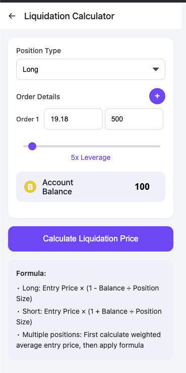

# Quantifury Liquidation Calculator

A Chrome extension to calculate liquidation prices for trading positions on Quantifury.



## Features

- Calculate liquidation prices for both long and short positions
- Support for single or multiple orders in one interface
- Interactive balance/position ratio slider
- Automatic calculation of weighted average entry price
- Clean, intuitive UI designed for traders

## Installation

### From Chrome Web Store

1. Visit the [Chrome Web Store page](#) (link will be available once published)
2. Click "Add to Chrome"
3. Confirm the installation when prompted

### Manual Installation (Developer Mode)

1. Download or clone this repository
2. Open Chrome and navigate to `chrome://extensions/`
3. Enable "Developer mode" using the toggle in the top-right corner
4. Click "Load unpacked" and select the extension folder
5. The extension icon should appear in your Chrome toolbar


## How to Use

### For Single Positions

1. Select your position type (Long or Short)
2. Enter your entry price and position size
3. Enter your account balance or use the slider to adjust the balance/position ratio
4. Click "Calculate Liquidation Price"
5. View your liquidation price, average entry price, and total position size


### For Multiple Positions

1. Select your position type (Long or Short)
2. Enter details for your first order
3. Click the "+" button to add more orders
4. Fill in entry price and size for each additional order
5. Remove orders if needed using the "×" button
6. Enter your account balance
7. Click "Calculate Liquidation Price"
8. View your results, including the weighted average entry price


## Formulas Used

The calculator uses the following formulas to determine liquidation prices:

- **Long positions**: Entry Price × (1 - Balance ÷ Position Size)
- **Short positions**: Entry Price × (1 + Balance ÷ Position Size)
- **Multiple positions**: First calculate weighted average entry price, then apply the appropriate formula

For multiple positions, the weighted average entry price is calculated as:
```
Weighted Average = Σ(Entry Price × Position Size) ÷ Σ(Position Size)
```

## Privacy

This extension:
- Works entirely offline
- Does not collect or transmit any data
- Does not require any permissions beyond basic extension functionality
- Stores no personal information

## Disclaimer

This calculator is provided for informational purposes only. While we strive for accuracy, always verify liquidation prices through your Quantifury account. Trading involves risk, and this tool should not be considered financial advice.

## Contributing

Contributions are welcome! If you'd like to improve the calculator:

1. Fork the repository
2. Create a feature branch (`git checkout -b feature/amazing-feature`)
3. Commit your changes (`git commit -m 'Add some amazing feature'`)
4. Push to the branch (`git push origin feature/amazing-feature`)
5. Open a Pull Request

## License

This project is licensed under the MIT License - see the [LICENSE](LICENSE) file for details.

## Credits

- Developed by [Your Name]
- Icon design by [Designer Name/Source]

## Screenshots

### Main Interface


### Results Display


---

Made with ♥ for the Quantifury trading community
